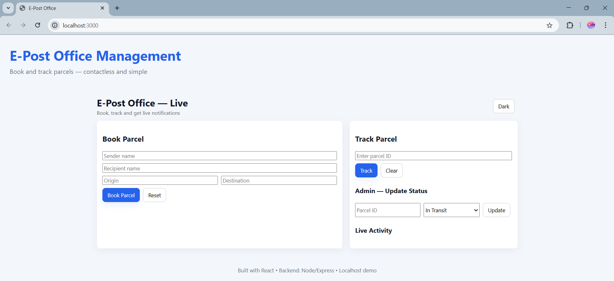
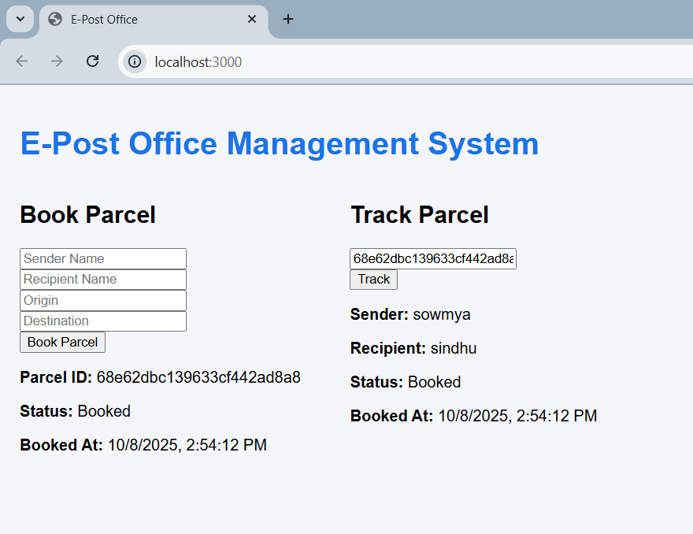

# 📮 E-Post Office Management System

A full-stack web application built with **MERN Stack (MongoDB, Express, React, Node.js)** that allows users to book, track, and manage postal parcels in real time.

##  Project Demo — E-Post Office Management System  

Below are live interface screenshots showing how the application works:  

### 🧾 1️⃣ Parcel Booking Interface  
Users can enter sender and recipient details, then click **“Book Parcel”** to create a shipment.  
  

---

### 🚚 2️⃣ Real-Time Parcel Tracking  
Once booked, users can track their parcel live using a unique Parcel ID.  
  

---

### 🎉 3️⃣ Live Notifications & Pop-ups  
When a parcel is booked or updated, users receive instant pop-up notifications and see live updates on screen.  
  

---

Each screenshot demonstrates the app’s **interactive UI**, **real-time updates**, and **user-friendly experience** powered by React, Express, MongoDB, and Socket.IO ⚡


---

## 🚀 Features
- 📦 **Book Parcels** — Create and register new postal bookings  
- 🔎 **Track Parcels** — View current parcel status and timestamps  
- 🔔 **Live Updates** — Real-time notifications via **Socket.IO**  
- 🎉 **Interactive UI** — Popups, confetti, and QR codes for parcel sharing  
- 🧾 **Database** — MongoDB Atlas for secure data storage

---

## 🧰 Tech Stack
| Layer | Technology |
|--------|-------------|
| Frontend | React.js, Axios, Toastify, CSS |
| Backend | Node.js, Express.js, Socket.IO |
| Database | MongoDB Atlas |
| Tools | Git, VS Code, Render (for deployment) |

---

## 🖥️ How to Run Locally
```bash
# Backend
cd backend
npm install
npm run dev

# Frontend
cd ../frontend
npm install
npm start
