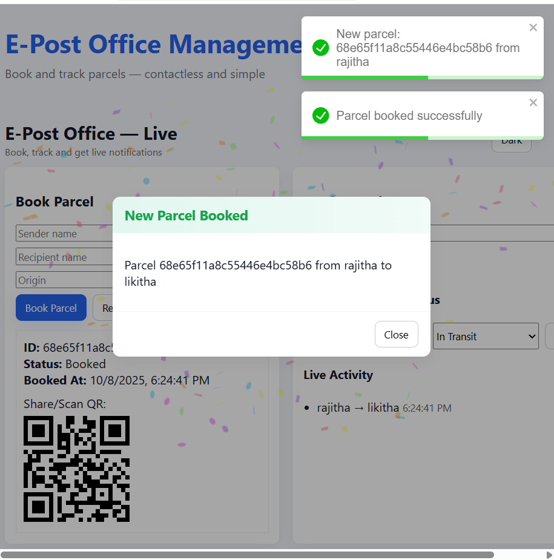

# 📮 E-Post Office Management System

A full-stack web application built with **MERN Stack (MongoDB, Express, React, Node.js)** that allows users to book, track, and manage postal parcels in real time.



---

## 🚀 Features
- 📦 **Book Parcels** — Create and register new postal bookings  
- 🔎 **Track Parcels** — View current parcel status and timestamps  
- 🔔 **Live Updates** — Real-time notifications via **Socket.IO**  
- 🎉 **Interactive UI** — Popups, confetti, and QR codes for parcel sharing  
- 🧾 **Database** — MongoDB Atlas for secure data storage

---

## 🧰 Tech Stack
| Layer | Technology |
|--------|-------------|
| Frontend | React.js, Axios, Toastify, CSS |
| Backend | Node.js, Express.js, Socket.IO |
| Database | MongoDB Atlas |
| Tools | Git, VS Code, Render (for deployment) |

---

## 🖥️ How to Run Locally
```bash
# Backend
cd backend
npm install
npm run dev

# Frontend
cd ../frontend
npm install
npm start
